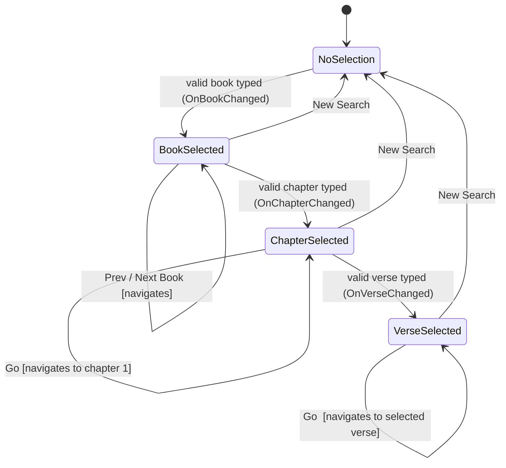

# Radiant Word Bible&#8482; — Navigation Ribbon

A custom toolbar for the Radiant Word Bible&#8482; Study document, built into Microsoft Word.
Navigate to any book, chapter, or verse in a few keystrokes or clicks.

Matt 5:14–16

---

## What it does

The Radiant Word Bible is a full-length Study Bible document — all 66 books, 1,189
chapters, and 31,102 verses — open in Microsoft Word. The navigation ribbon is a
custom toolbar that appears as its own tab, **Radiant Word Bible**, in the Word ribbon.

It gives you three ways to move through the text:

- Type the **book** you want
- Type the **chapter**
- Type the **verse**, then press **Go**

The **Go** button is the primary navigation trigger — it moves the document to the
selected Book, Chapter, and Verse. The **◀** and **▶** Prev/Next buttons beside
each selector also navigate immediately, one step at a time.

---

## The navigation toolbar

```text
◀  Genesis          ▼  ▶       ← Book row
◀  1                ▼  ▶       ← Chapter row
◀  1                ▼  ▶  Go   ← Verse row + Go button

[New Search]    [About]
```

Each row has three controls: a **Previous** button, a **selector** (the text field
with a dropdown), and a **Next** button.

The rows unlock progressively:

| What you have done | What is available |
|--------------------|-------------------|
| Nothing yet | Book row only |
| Selected a book | Book row + Chapter row |
| Selected a chapter | Chapter row + Verse row |
| Selected a verse | All rows |

This keeps the choices simple. You cannot jump to a verse before you have confirmed
which book and chapter you are in.

---

## Navigation state machine

The ribbon controller is a four-state machine. Understanding the states makes the
progressive-unlock behaviour predictable.



**States and what they unlock:**

| State | Book row | Chapter row | Verse row | Go |
|---|---|---|---|---|
| `NoSelection` | active | — | — | — |
| `BookSelected` | active | active | — | — |
| `ChapterSelected` | active | active | active | active |
| `VerseSelected` | active | active | active | active |

**Transition rules:**

- State advances on **valid input** in each field; invalid input sets the validity
  flag and stays in the current state (error shown in status bar).
- **Prev/Next** buttons navigate immediately and stay in the same state.
- **Go** navigates and stays in the same state.
- **New Search** resets to `NoSelection` from any state.
- State never advances past `VerseSelected`; there is no terminal state.

---

## Selecting a book

Click the Book selector, or press **Alt, Y2, B** to focus it directly from the keyboard.

**Type a name** — full or abbreviated: `Genesis`, `Gen`, `Gn`, `1 Cor`, `1cor`,
`Jn`, `Rev` all work. Capitalisation does not matter. This is the primary
supported input method.

The dropdown list is present but not yet populated — book selection by typing
is the current navigation path.

Once the book is confirmed, the Chapter row becomes available and the ribbon state
is set to that book. Document navigation occurs when a chapter/verse navigation
action is executed.

### Previous / Next Book

The **◀** and **▶** buttons beside the Book selector step one book backward or
forward and navigate immediately. At the first or last book, pressing the
boundary button shows a message in the status bar.

---

## Selecting a chapter

After a book is selected, the Chapter selector becomes active.

Type the chapter number. The Verse row becomes available once a valid chapter is
entered. Press **Go** to navigate the document to that chapter.

### Previous / Next Chapter

**◀** and **▶** step through chapters within the current book and navigate
immediately. At the first or last chapter of the book, pressing the boundary
button shows a message in the status bar.

---

## Selecting a verse

After a chapter is selected, the Verse selector becomes active.

Type the verse number. Press **Go** to navigate, or use **◀ ▶** to step through verses immediately.

### Previous / Next Verse

**◀** and **▶** step through verses within the current chapter and navigate
immediately. At the first or last verse of the chapter, pressing the boundary
button shows a message in the status bar.

---

## Keyboard navigation

The ribbon is fully keyboard-navigable — no mouse required.

### Tab between fields

After typing in a selector, press **Tab** to confirm and move to the next selector:

```text
Book field  →  Tab  →  Chapter field  →  Tab  →  Verse field  →  Tab  →  Go  →  Tab  →  New Search
```

> **Tab, not Enter.** Pressing Enter confirms the current field and returns focus to
> the document. Pressing Tab confirms and moves to the next selector, keeping you in
> the toolbar.

Once Book, Chapter, and Verse are set, press **Go** (or **Alt, Y2, G**) to navigate
the document to that location. The **◀** and **▶** Prev/Next buttons navigate
immediately without requiring Go.

### Alt shortcuts (KeyTips)

Press **Alt** to activate the ribbon. Short letter badges appear on every control.
Press the letter shown to activate that control immediately, from anywhere in the
document.

| Key sequence | Action |
|--------------|--------|
| Alt, Y2 | Focus the Radiant Word Bible tab |
| Alt, Y2, B | Focus the Book selector |
| Alt, Y2, C | Focus the Chapter selector |
| Alt, Y2, V | Focus the Verse selector |
| Alt, Y2, G | Go (navigate to selected Book/Chapter/Verse) |
| Alt, Y2, S | New Search |
| Alt, Y2, A | About |
| Alt, Y2, [ | Previous Book |
| Alt, Y2, ] | Next Book |
| Alt, Y2, , | Previous Chapter |
| Alt, Y2, . | Next Chapter |
| Alt, Y2, < | Previous Verse |
| Alt, Y2, > | Next Verse |

---

## New Search

The **New Search** button (or **Alt, Y2, S**) clears all three selectors and
returns the toolbar to its starting state — Book row active, Chapter and Verse
rows inactive.

Use it whenever you want to navigate to a completely different passage. You do not
need to erase the selectors manually; New Search resets everything at once.

---

## Example: going to John 3:16

1. Press **Alt, Y2, B** — Book selector is focused
2. Type `Jn` — the book resolves to John
3. Press **Tab** — Chapter selector is focused
4. Type `3`
5. Press **Tab** — Verse selector is focused
6. Type `16`
7. Press **Tab** — Go button is focused
8. Press **Enter** (or **Space**) — the document navigates to John 3:16

Or with the mouse: click the Book selector, type `Jn`, click the Chapter selector,
type `3`, click the Verse selector, type `16`, then click **Go**.

---

## Example: reading through the Psalms

1. Navigate to Psalm 1:1 (as above)
2. Press **Alt, Y2, .** (Next Chapter) to step to Psalm 2
3. Continue pressing **.** to read chapter by chapter
4. Press **Alt, Y2, ,** (Previous Chapter) to go back

---

## System requirements

- Microsoft Word 365 (Windows)
- Macro-enabled document format (`.docm`)
- Macros must be enabled in Word's Trust Center for the document

---

## About

The Radiant Word Bible&#8482; navigation ribbon is part of the **adaept** Study Bible
project. The goal is a full-featured, keyboard-accessible Bible study environment
inside the familiar Word interface — no separate app required.

---

## Legal notices

Radiant Word Bible and RWB are trademarks of adaept. All rights reserved.

Microsoft and Microsoft Word are registered trademarks of Microsoft Corporation.
adaept is not affiliated with, endorsed by, or sponsored by Microsoft Corporation.
